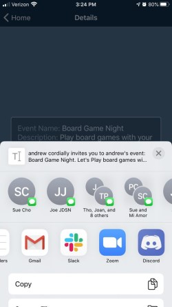

# UnBucket List

## Mobile event planning app for when the quarantine lifts

### Sign in or sign up!

 

### Create custom events and send invites to your friends!

  

Get Started:

Fork and clone the repo.

Run `npm run start` and the expo client should spin up the metro bundler.

Download the expo client app on your phone to test it on your phone or just run it in the browser through the metro bundler.

Run `npm run dev` to spin up the dev server.
